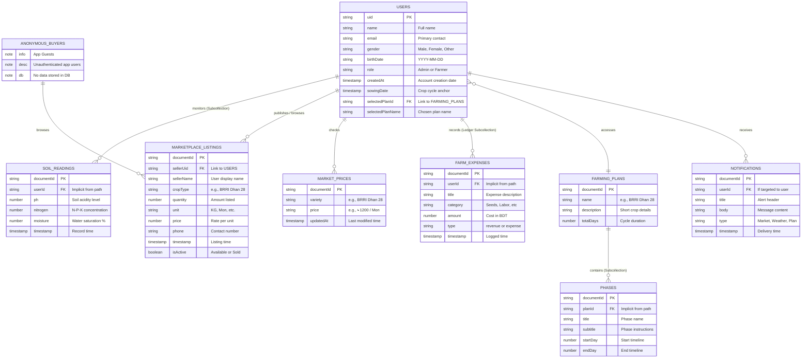
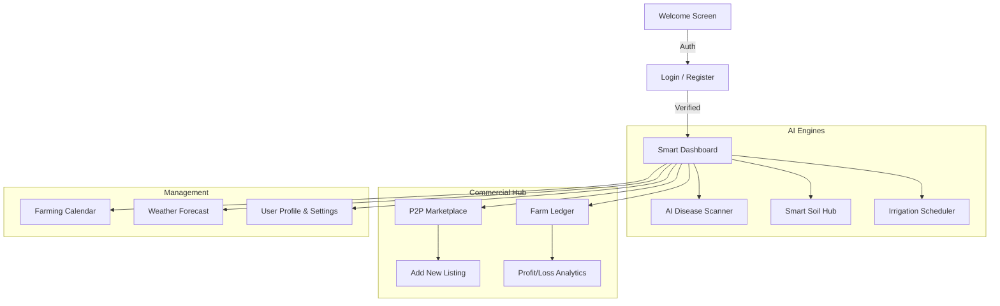

# Project Report: Bij Theke Bhaat

**DEPARTMENT OF COMPUTER SCIENCE AND ENGINEERING**

**Course:** CSE 489  
**Name:** Sahil Ishan Tonmoy  
**ID:** 22301612  
**Email:** sahil.ishan.tonmoy@g.bracu.ac.bd 

**Project Title:** Bij Theke Bhaat: AI-Powered Smart Agriculture Ecosystem for Rice Farming  

---

### **Project Features:**

**1. Secure Authentication Suite:**
*   **Firebase User Registration**: Secure account creation for new farmers and buyers.
*   **Email Verification System**: Built-in security layer ensuring only verified users access the platform.
*   **Persistent Login System**: Smooth authentication experience with session management.

**2. Modern Dynamic Interface:**
*   **Dual-Theme Support**: A professional UI that supports both **Light and Dark modes** for comfortable viewing in different lighting conditions.
*   **Bilingual Localization**: Full support for English and Bengali languages across every screen.
*   **Responsive Dashboard**: A glassmorphic, interactive home screen for quick access to all modules.

**3. Core AI Engines:**
*   **AI Disease Scanner**: Computer vision analysis for rice pathogens with treatment advice.
*   **AI Soil Advisor**: Multi-parameter soil health analysis and fertilization strategies.
*   **AI Irrigation Scheduler**: Smart water requirement calculations based on weather and plant biology.

**4. Financial & Business Tools:**
*   **Farm Ledger & Expense Tracker**: Digital bookkeeping for all farming inputs (Seed, Labor, etc.).
*   **Interactive Profit/Loss Analytics**: Real-time financial health summaries.
*   **Live Market Prices**: Tracking system for local rice and fertilizer prices.
*   **P2P Marketplace**: Global listing platform for direct seed-to-rice trading.

**5. Production & Planning:**
*   **Automated Farming Calendar**: Generates a 100-day cultivation roadmap.
*   **Yield Calculator**: Digital tool to predict harvest volume (Mond/Bigha).
*   **Growth Plan Customizer**: Ability to adjust plans for different rice varieties.
*   **Hyper-Local Weather Center**: Forecasts, rain alerts, and humidity tracking.

---

### **Database Schema Diagram (Entity-Relationship)**

This defines the exact underlying backend architecture for the complete project, showing how the **USERS** core interacts with the farming modules.

*Figure 1: High-level relational structure of the completed Bij Theke Bhaat database.*

---

---

---

---

### **App Wireframe Flow:**

---

### **Online Resources used:**

**a) Reference:**
*   **W3schools.com**: Used for mastering advanced CSS Flexbox and Grid layouts to create the app’s modern glassmorphic UI.
*   **Youtube**: 
    *   **Tutorial 1**: [Flutter & Firebase Masterclass](https://www.youtube.com/watch?v=D4nhaszNW4o) - For Authentication and Firestore integration.
    *   **Tutorial 2**: [Introduction to Gemini API for Flutter](https://www.youtube.com/watch?v=hB9iI7O7X1E) - Official Google link for implementing AI.
*   **Open-Meteo Documentation**: For hyper-local weather API integration [open-meteo.com](https://open-meteo.com/).
*   **Flutter.dev**: Official documentation for widget lifecycle and state management.

**b) Stackoverflow or github links:**
*   **StackOverflow**: [How to handle Android 13+ Notification Permissions](https://stackoverflow.com/questions/72310162/how-do-i-request-push-notification-permissions-for-android-13) - Key resource for notification permissions.
*   **GitHub**: [flutter_dotenv repository](https://github.com/java-james/flutter_dotenv) - Used for implementing the secure .env system.
*   **GitHub**: [google_generative_ai repository](https://github.com/google/generative-ai-dart) - Reference for the multi-model AI rotation logic.

---

### **Future Enhancements:**

The following enhancements can be added to the current system which will significantly improve its utility and performance:

1.  **Advanced Understanding of System (IoT Integration):**
    Integrating physical **IoT sensors** (ESP32/Arduino) directly in the rice fields to allow the system to have a real-time "understanding" of field conditions (moisture, temperature, nitrogen levels) without manual entry.

2.  **Enhanced Login System (Biometric & Social Auth):**
    Expanding the security layer to include **Biometric Authentication** (Fingerprint/FaceID) and **OAuth 2.0** (Sign-in with Google or Facebook) to reduce friction during user onboarding.

3.  **Advanced Reporting System (AI Insights & PDF Export):**
    Adding **Automated PDF Generation** for seasonal farm ledgers and implementing **Predictive Analytics** to forecast future crop yields and potential financial risks based on historical trends.
